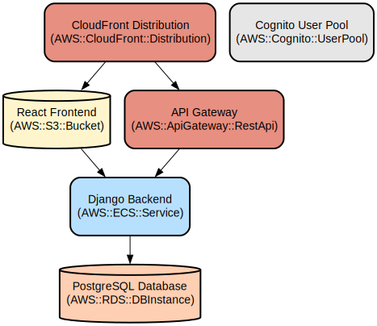

# Phantom Banking: Secure Embedded Wallet Solution for the Unbanked

Phantom Banking is a full-stack application that provides a secure embedded wallet solution designed specifically for unbanked populations. The platform combines robust authentication, role-based access control, and secure wallet management to deliver financial services through a modern web interface.

The application is built using Django REST Framework for the backend API and React with TypeScript for the frontend. It features JWT-based authentication, comprehensive security middleware, and detailed API documentation. The platform supports multiple user roles (admin, merchant, user) and includes features for user management, wallet operations, and secure financial transactions.

## Repository Structure
```
.
├── backend/                      # Django backend application
│   ├── core/                    # Core Django project settings and configuration
│   ├── security/                # Authentication and authorization module
│   │   ├── middleware.py        # Security headers and request logging
│   │   ├── models.py           # Custom user model definition
│   │   └── views.py            # Authentication and user management views
│   └── wallets/                # Wallet management module
├── frontend/                    # React TypeScript frontend application
│   ├── src/
│   │   ├── api/                # API integration layer
│   │   └── services/           # Core services including auth and interceptors
├── docs/                       # Documentation site built with Docusaurus
└── postman/                    # Postman collection for API testing
```

## Usage Instructions
### Prerequisites
- Python 3.8 or higher
- Node.js 16 or higher
- PostgreSQL 12 or higher
- npm or yarn package manager

### Installation

1. Clone the repository:
```bash
git clone https://github.com/your-username/phantom-banking.git
cd phantom-banking
```

2. Install dependencies:
```bash
# Install all dependencies (frontend, backend, and root)
npm run install:all
```

3. Set up the database:
```bash
# Create a PostgreSQL database
createdb phantom_banking2

# Run migrations
cd backend
python manage.py migrate
```

4. Set up environment variables:
```bash
# Backend (.env)
DJANGO_SECRET_KEY=your-secret-key
DJANGO_DEBUG=True
POSTGRES_DB=phantom_banking2
POSTGRES_USER=your-db-user
POSTGRES_PASSWORD=your-db-password
POSTGRES_HOST=localhost
POSTGRES_PORT=5432
```

### Quick Start

1. Start the development servers:
```bash
# Start both frontend and backend servers
npm start
```

2. Access the application:
- Frontend: http://localhost:3000
- Backend API: http://localhost:8000
- API Documentation: http://localhost:8000/swagger/

### More Detailed Examples

1. User Registration:
```typescript
const registerUser = async (userData) => {
  const response = await axios.post('/api/auth/register/', {
    username: userData.username,
    password: userData.password,
    email: userData.email,
    role: 'merchant'
  });
  return response.data;
};
```

2. Authentication:
```typescript
const login = async (credentials) => {
  const response = await axios.post('/api/auth/login/', {
    username: credentials.username,
    password: credentials.password
  });
  return response.data;
};
```

### Troubleshooting

1. JWT Token Issues
- Problem: 401 Unauthorized errors
- Solution: Check if the access token has expired
```typescript
// Check token expiration
const isTokenExpired = (token) => {
  const decoded = jwt_decode(token);
  return decoded.exp * 1000 < Date.now();
};
```

2. CORS Issues
- Problem: API requests blocked by CORS
- Solution: Verify CORS settings in Django
```python
# backend/core/settings.py
CORS_ALLOWED_ORIGINS = [
    "http://localhost:3000",
    "http://127.0.0.1:3000",
]
```

## Data Flow

The application follows a standard client-server architecture with JWT authentication and role-based access control. Data flows through secure API endpoints with proper validation and authorization at each step.

```ascii
Client (React) --> Axios Interceptor --> Django API --> PostgreSQL
     ^                    |                  |
     |                    |                  |
     +--------------------+------------------+
         JWT Token Flow & Refresh
```

Key component interactions:
1. Frontend makes authenticated API requests using Axios interceptors
2. JWT tokens handle authentication state and refresh
3. Backend validates requests through security middleware
4. Role-based permissions control access to resources
5. Database operations are performed through Django ORM
6. Responses are formatted according to REST conventions
7. Error handling includes proper status codes and messages

## Infrastructure



The application uses the following key infrastructure components:

### Database
- PostgreSQL database configured through Django settings
- Custom user model for extended functionality
- Migration system for schema management

### Security
- JWT authentication with refresh token rotation
- Security headers middleware
- Request logging middleware
- CORS configuration for frontend access
- SSL/TLS settings for production

### Logging
- File-based logging system
- Separate security module logging
- Detailed formatting for debugging