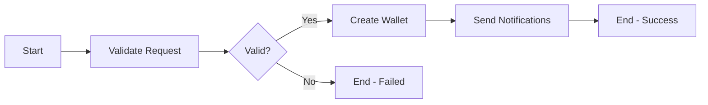

# Camunda BPM Integration

This document describes the integration of Camunda BPM with our security and wallet management processes.

## Overview

We use Camunda BPM to orchestrate and manage complex business processes in our application, particularly for:

1. Wallet Creation Process
2. Security Processes:
   - KYC Validation
   - Merchant Approval
   - Suspicious Activity Handling
   - Email Verification

## Prerequisites

- Camunda Platform 7.x
- Python 3.8+
- Django 3.2+

## Configuration

The Camunda integration is configured through environment variables:

```env
CAMUNDA_REST_URL=http://localhost:8080/engine-rest
CAMUNDA_CLIENT_ID=phantom-worker
CAMUNDA_CLIENT_MAX_TASKS=1
CAMUNDA_CLIENT_LOCK_DURATION=10000
CAMUNDA_CLIENT_ASYNC_RESPONSE_TIMEOUT=5000
```

## Process Definitions

### Wallet Creation Process

The wallet creation process consists of the following steps:

1. Validate Wallet Request
2. Create Wallet
3. Send Notifications



### Security Processes

#### KYC Validation
- Validates user KYC data
- Updates user verification status
- Logs validation events

#### Merchant Approval
- Processes merchant approval requests
- Updates merchant status
- Sends approval notifications

#### Suspicious Activity Handling
- Processes suspicious activity alerts
- Implements security measures
- Sends notifications

#### Email Verification
- Generates verification tokens
- Sends verification emails
- Tracks verification status

## Worker Implementation

### Starting the Workers

Use the management command to start all Camunda workers:

```bash
python manage.py start_camunda_workers
```

### Worker Topics

1. Wallet Workers:
   - `validate-wallet-request`
   - `create-wallet`
   - `notify-wallet-creation`

2. Security Workers:
   - `validate-kyc-data`
   - `process-merchant-approval`
   - `handle-suspicious-activity`
   - `process-email-verification`

## Error Handling

Workers implement consistent error handling through:
- Logging of all errors
- Transaction management
- Retry mechanisms
- Error events in BPMN

## Monitoring

Monitor process execution through:
1. Camunda Cockpit
2. Application logs
3. Security event logs
4. Audit trails

## Best Practices

1. Always use transactions for database operations
2. Log all significant events
3. Implement proper error handling
4. Use timeouts for external tasks
5. Monitor worker health
6. Keep processes modular and focused

## Development Guidelines

When extending or modifying processes:

1. Update BPMN diagrams
2. Test process flows
3. Document changes
4. Update worker implementations
5. Add appropriate logging
6. Consider security implications

## Testing

Test process definitions and workers:

```python
from django.test import TestCase
from security.camunda_workers import handle_validate_kyc
from wallets.camunda_workers import handle_create_wallet

class CamundaWorkersTest(TestCase):
    def test_kyc_validation(self):
        # Test implementation
        pass

    def test_wallet_creation(self):
        # Test implementation
        pass
```